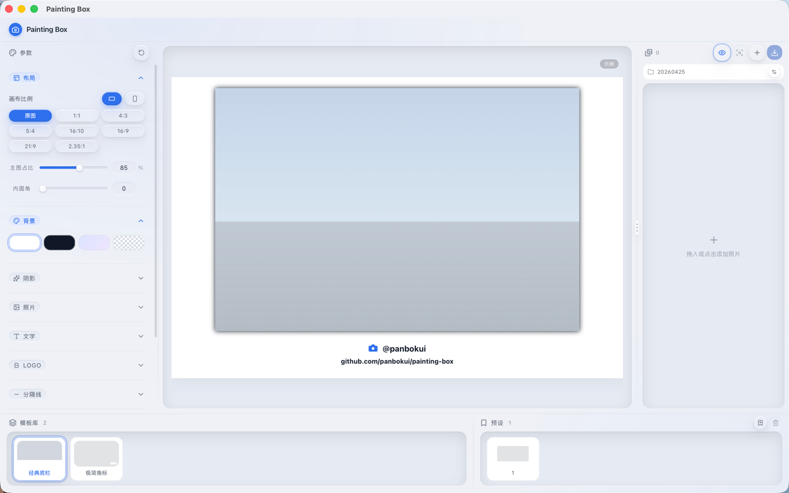

<!-- LOGO -->
<h1>
<p align="center">
  
  <br>Painting Box
</h1>
  <p align="center">
    为摄影爱好者设计的照片水印 & 画框桌面工具，让相机参数优雅地随照片呈现。
    <br />
    <a href="#下载">下载</a>
    ·
    <a href="#功能亮点">功能</a>
    ·
    <a href="#模板一览">模板</a>
    ·
    <a href="#本地构建">构建</a>
    ·
    <a href="#作者">作者</a>
  </p>
</p>

<p align="center">
  <a href="https://github.com/Junglepan/Painting-Box/releases">
    
  </a>
  
  
  
</p>

---

## 预览



## 下载

前往 [Releases](https://github.com/Junglepan/Painting-Box/releases/latest) 下载最新版本：

| 平台 | 文件 |
|------|------|
| macOS（Apple Silicon + Intel 通用） | `Painting.Box_x.x.x_universal.dmg` |
| Windows x64 | `Painting.Box_x.x.x_x64-setup.exe` |

> **macOS 首次打开提示"已损坏"或"无法验证开发者"：**
>
> ```bash
> xattr -cr /Applications/Painting\ Box.app
> ```
>
> 执行后直接双击打开即可。

## 功能亮点

- **13 款水印模板** — 覆盖经典底栏、杂志双栏、电影黑边、胶片齿孔、品牌致敬（徕卡风 / 富士 / 哈苏）、暗房文化等多种风格
- **通用裁切** — 支持 2.35:1 / 16:9 / 4:3 / 3:2 / 1:1 等比例裁切，裁切位置可自由调节，与画布比例正交独立
- **实时预览** — SVG 单源渲染，所见即所得，预览与导出完全一致
- **品牌 Logo** — 自动识别 50+ 相机品牌，支持 Original / Black / White / Auto（跟随背景）四种配色
- **参数展示** — 机身、镜头、焦距、光圈、快门、ISO、日期自由组合
- **画框定制** — 画布比例 & 方向、背景色、圆角、边框、阴影、字号、字体、文字颜色均可调
- **批量导出** — Rust + rayon 并行处理，支持 JPG / PNG / WebP，默认目录零弹窗
- **预设管理** — 保存并复用个人水印风格，一键应用到所有照片
- **亮色 / 暗色主题** — 支持跟随系统自动切换
- **版本更新提示** — 自动检测新版本，一键跳转下载

## 模板一览

| 模板 | 说明 |
|------|------|
| 经典底栏 | Logo + 参数底部横栏，最通用的水印布局 |
| 杂志双栏 | 左侧品牌信息，右侧拍摄参数，杂志排版风格 |
| 极简角标 | 图片下方右对齐轻量水印 |
| 电影黑边 | 上下黑边带，下栏白色文字 |
| 2.35:1 黑边 | 2.35:1 裁切 + 16:9 画布，电影宽银幕质感 |
| 胶片齿孔 | 上下黑带 + 左右齿孔，复古胶卷风格 |
| 徕卡风 | 中央分隔 + 红色细线，致敬小米徕卡水印 |
| 富士经典 | 米白底 + 绿色品牌口音 + 胶片模拟标签 |
| 哈苏 | 纯黑底栏 + 橙色品牌口音，极简到只剩型号 |
| 旧相册 | 米色调底纹，四角黑色三角夹 |
| 印刷标记 | 四角 L 形对位标 + CMYK 色块 |
| 暗房样片 | 黑色相纸边 + 窄白边 + PROOF 印记 |
| 接触印样 | 黑底 + 上下齿孔 + 白色细边，模拟胶卷小样 |

## 技术栈

| 层 | 技术 |
|---|---|
| 前端 | React 18 + TypeScript + Vite |
| UI | shadcn/ui + Tailwind CSS + Zustand |
| 桌面框架 | Tauri 2 + Rust |
| 渲染管线 | 前端生成 SVG → Rust 端 resvg 光栅化导出 |
| 图像解码 | libjpeg-turbo（JPEG）、sips（HEIC，macOS） |
| 图像缩放 | fast_image_resize（SIMD 加速） |
| 并行导出 | rayon |

## 本地构建

**前置依赖**

- [Rust](https://rustup.rs/) + Cargo
- [Bun](https://bun.sh/)
- cmake + nasm（用于编译 libjpeg-turbo）

```bash
# macOS：安装构建工具
brew install cmake nasm

# 安装前端依赖
bun install

# 开发模式
bunx tauri dev

# 生产构建
bunx tauri build
```

## 使用

1. 启动后拖入照片，或点击列表空白区域导入
2. 底部模板库选择水印模板
3. 右侧面板调整参数（画布、字体、颜色、阴影等）
4. 设置默认导出目录（一次设置，后续零弹窗）
5. 点击单张导出按钮，或使用底部批量导出

## 作者

[Junglepan](https://github.com/Junglepan) · B 站 [@土豆怪725](https://search.bilibili.com/all?keyword=%E5%9C%9F%E8%B1%86%E6%80%AA725&search_type=bili_user) · 小红书 @土豆怪 · 抖音 @土豆怪

## License

[MIT](LICENSE)
