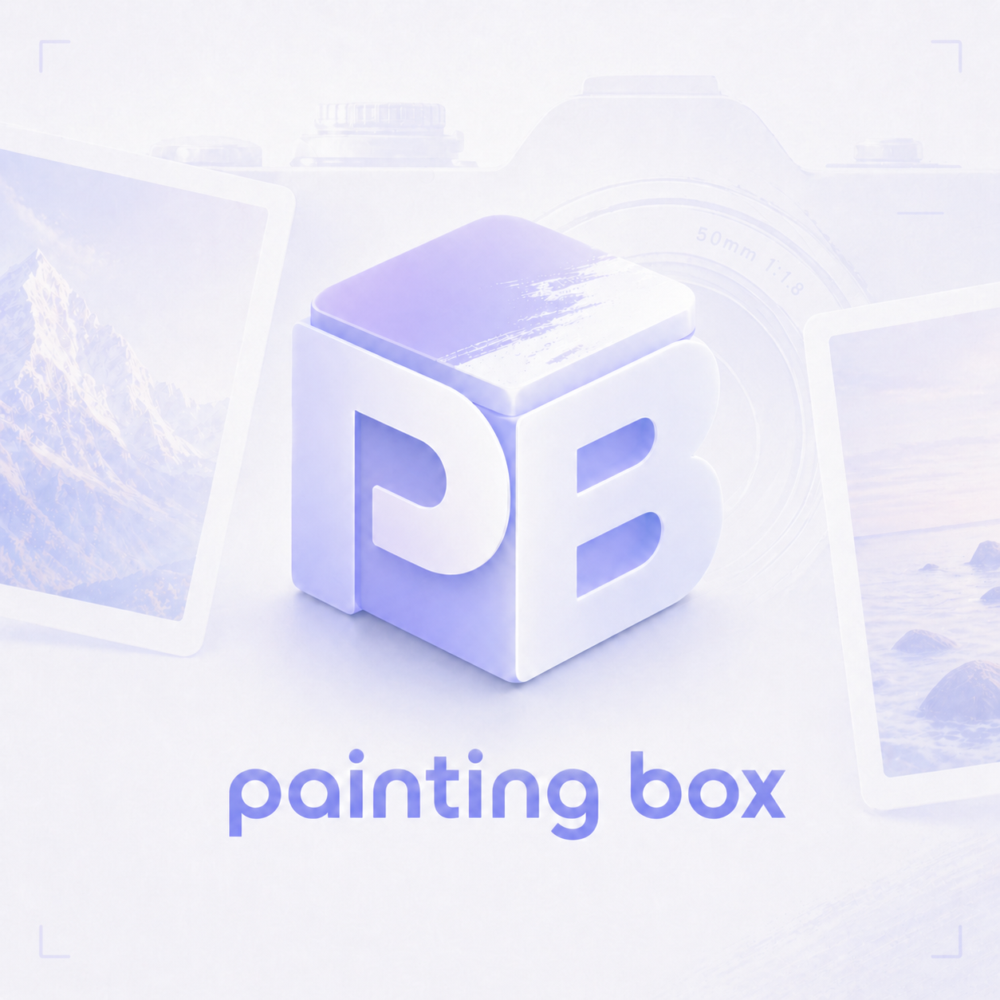

<!-- LOGO -->
<h1>
<p align="center">
  
  <br>Painting Box
</h1>
  <p align="center">
    为摄影爱好者设计的照片水印工具，让相机参数优雅地随照片呈现。
    <br />
    <a href="#下载">下载</a>
    ·
    <a href="#功能">功能</a>
    ·
    <a href="#本地构建">本地构建</a>
    ·
    <a href="#作者">作者</a>
  </p>
</p>

<p align="center">
  <a href="https://github.com/Junglepan/Painting-Box/releases">
    
  </a>
  
  
</p>

---

## 预览



## 下载

前往 [Releases](https://github.com/Junglepan/Painting-Box/releases) 下载最新版本：

| 平台 | 文件 |
|------|------|
| macOS（Apple Silicon + Intel 通用） | `Painting.Box_x.x.x_universal.dmg` |
| Windows x64 | `Painting.Box_x.x.x_x64-setup.exe` |

**macOS 首次打开提示"已损坏"或"无法验证开发者"：**

```bash
xattr -cr /Applications/Painting\ Box.app
```

执行后直接双击打开即可。

## 功能

- **水印模板**：经典底栏、极简角标，更多模板持续更新
- **实时预览**：所见即所得，无需导出即可预览效果
- **品牌 Logo**：自动识别 50+ 相机品牌，支持 Original / Black / White 三种配色
- **参数展示**：机身、镜头、焦距、光圈、快门、ISO 自由组合
- **批量导出**：rayon 并行处理，支持 JPG / PNG / WebP，默认目录零弹窗
- **预设管理**：保存并复用个人水印风格

## 技术栈

| 层 | 技术 |
|---|---|
| 前端 | React 18 + TypeScript + Vite |
| UI | shadcn/ui + Tailwind CSS + Zustand |
| 后端 | Tauri 2 + Rust |
| 图像处理 | libjpeg-turbo + fast_image_resize（SIMD） |
| 字体渲染 | ab_glyph |
| Logo | resvg（SVG 光栅化） |

## 本地构建

**前置依赖**

- [Rust](https://rustup.rs/) + Cargo
- [Bun](https://bun.sh/)
- cmake + nasm（用于编译 libjpeg-turbo）

```bash
# macOS：安装构建工具
brew install cmake nasm

# 安装前端依赖
bun install

# 开发模式
bunx tauri dev

# 生产构建
bunx tauri build
```

## 使用

1. 启动后拖入照片，或点击列表空白区域导入
2. 在右侧面板调整水印模板与参数
3. 设置默认导出目录（一次设置，后续零弹窗）
4. 点击单张导出按钮，或使用底部批量导出

## 作者

[@panbokui](https://github.com/panbokui) · Bilibili：@土豆怪725 · 小红书：@StudentPanbk

## License

[MIT](LICENSE)
